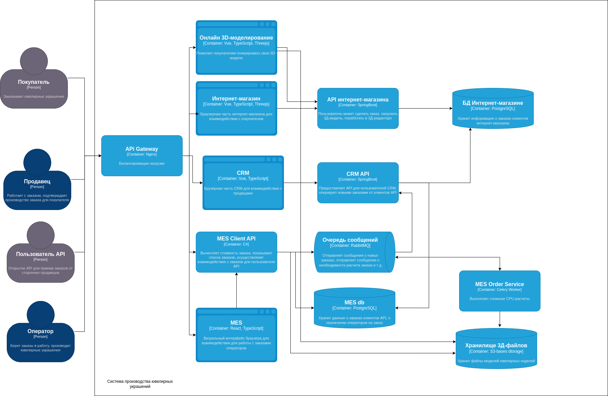

# Анализ схемы и описание системы. Разработка инициатив, которые необходимы для устранения нежелательных ситуаций.

## Существующие проблемы системы, уже поступившие от пользователей:

1) Жалобы со стороны пользователей API. Представители компаний ежедневно сообщают, что не получили свои заказы
2) Жалобы от операторов: когда они заходят на первую страницу MES, система долго прогружается
3) Недовольство клиентов онлайн-магазина (B2C) на просроченные заказы

Разберем проблемы друг за другом.

### 1) Жалобы со стороны пользователей API. Представители компаний ежедневно сообщают, что не получили свои заказы

***Объяснение причин возникновения:***

В данный момент MES API занимается несколькими задачами:

- API для клиентов
- Взаимодействие с API операторов (MES)
- Реализация сложных расчетов (CPU)

Когда заказов стало много, количество задач для расчета увеличилось, сервис MES API перестал справляться с нагрузкой,
став узким местом. Кроме того это изначально является проблемой, так как расчет занимает от 2-30 минут, что является
сложной CPU задачей, тормозящей работу сервиса. Из-за этого заказы не обрабатываются вовремя, а клиенты не получают
свои заказы. При этом API не является достаточно нагруженной частью. Напрашивается масштабирование, но в текущей
архитектуре придется масштабировать весь сервис, в том числе и API, что будет выглядеть как лишнее расходование
ресурсов. Кроме того, в сервис ходит сервис работы с операторами, что увеличивает нагрузку.

***Решение проблемы:***

- Решение проблемы:***Выделить все расчеты CPU в отдельные таски на новом сервисе MES Order Service***. Подключить
  расчет тасок через Celery.
  Таски будут прослушивать очередь RabbitMQ (как и есть сейчас). В случае, когда будет необходимо масштабироваться,
  нужно будет добавить больше воркеров. Если будет не хватать мощности сервера - можно будет перенести воркеры Celery на
  другой сервер (распределенность). C хранилищем 3D-файлов будет взаимодействовать новый MES Order Service.
- ***MES API нужно переименовать в MES Clients API*** - он будет взаимодействовать с клиентами и с БД, на нем не будет
  сложных
  CPU-задач
- ***Модель поведения*** следующая: клиент отдает заказ на просчет, MES Clients API сохраняет модель в хранилище
  3Д-файлов,
  отправляет задачу на просчет в RabbitMQ, далее задачу на расчет считывает MES Order Service, производит сложные
  CPU-расчеты, сохраняет модель в хранилище, отправляет в RabbitMQ событие о том, что расчет завершен. Это событие
  подхватит MES Clients API, запишет в свою БД PostgreSQL.

***Возможность дальнейшего масштабирования (потенциальные проблемы):***

- На уровне приложения: увеличить количество инстансов API с равномерной балансировкой нагрузки, предварительно добавить
  балансировщик API Gateway. Увеличить количество воркеров-обработчиков заказов.
- На уровне БД: шардирование MES db + репликация по паттерну read replica. Сервис взаимодействует с БД по паттерну CQRS
- На уровне Celery-воркеров: увеличить количество инстансов обработчиков расчета заказа

### 2) Жалобы от операторов: когда они заходят на первую страницу MES, система долго прогружается

***Объяснение причин возникновения:***

Когда заказов со стороны клиентов API (MES API) стало много, количество задач для расчета увеличилось, сервис MES API
перестал справляться с нагрузкой, что для оператора выражается в долгой загрузке запросов AP (так как MES ходит к MES
API за данными)I. Зависимость от другого сервиса означает то, что задержки в нем приведут к задержкам в связанных
сервисах, что и произошло.

***Решение проблемы:***

- Основное и очень важное решение: реализация п1, которое по сути уберет и эту, связанную проблему
- Дополнительно, можно ***добавить кеш*** на выгрузку текущих заказов для операторов

### 3)  Недовольство клиентов онлайн-магазина (B2C) на просроченные заказы

***Объяснение причин возникновения:***

Сервис онлайн-магазина (Internet Shop) занимается несколькими задачами:

- Взаимодействие с пользователем для создания заказа
- Взаимодействие с пользователем по части 3D-моделирования.
- Вторая задача является достаточно тяжеловесной по CPU и сервис должен иметь возможность масштабироваться для
  наращивания возможности параллельной обработки 3D-моделей.

***Решение проблемы:***

- ***Выделить отдельный микросервис, который будет заниматься всеми расчетами в 3D***. Всю логику по 3D-моделированию
  нужно
  вынести из сервиса Internet Shop. В случае, если пользователю будет необходимо использовать 3D-моделирование в
  процессе создания заказа, его запросы будут перенаправляться на сервис 3D-моделирования. Все остальные более
  легковесные запросы по заказы будут, как и раньше, перенаправляться на сервис онлайн-магазина. К БД Shop Api будут
  ходить оба сервиса, а к 3D File Storage будет ходить только новый сервис по 3D-расчетам, чтобы сохранять модели.
- ***Добавить API Gateway***. Это необходимо, чтобы корректно перенаправлять запросы между микросервисами.
- Использовать ***подписанные ссылки*** presigned url и прямую загрузку данных от клиента в S3-хранилище, чтобы снизить
  нагрузку. Генерировать url будет бэкенд
- Позже можно добавить чанкованную загрузку файлов в S3-хранилище по тем же подписанным ссылкам

***Возможность дальнейшего масштабирования (потенциальные проблемы):***

- На уровне приложения: увеличить количество инстансов API онлайн-магазина с равномерной балансировкой нагрузки,
  предварительно добавить балансировщик API Gateway. Увеличить количество новых микросервисов 3D-моделирования,
  поставив между новым микросервисом и онлайн-магазином балансировщик, распределяющий запросы между свободными
  инстансами.
- На уровне БД: шардирование Shop API + репликация

## Другие потенциальные проблемы

1) Важно как можно скорее ввести Api Gateway, чтобы иметь возможность балансировать нагрузку между инстансами сервисов
2) Необходимо ввести систему мониторинга, чтобы отслеживать узкие места - наполненные очереди, не справляющиеся с
   нагрузкой
   сервисы, чтобы успевать предотвращать и решать проблемы
3) Пользователи не узнают оперативно об изменениях в статусе заказа: в этом может помочь сервис нотификации, который
   прослушивает очередь RabbitMQ на события о создании заказа, готовности заказа, готовности расчета стоимости заказа и
   т
   д. Такие события могут отправлять непосредственно сервисы, генерирующие эти события, и класть их в очередь. Сервис
   нотификации может отправлять сообщения пользователю в приложение, на почту или через подписку на TG-бота.

## Необходимый штат

- Необходимо добавить одного или двух девопс-инженеров, которые будут помогать в развертке новых инстансов, API Gateway,
  а
  также следить за метриками. В случае дальнейшего роста систем необходимо будет настраивать шардирование и репликацию
  БД.
- Стоит добавить разработчика на С# для улучшения функциональности и допиливания новых фичей в MES backend. Это важная
  фича бизнеса, которая постоянно должна приносить новые возможности и быть безотказной.
- Также стоит добавить 1-2 Java-разработчиков для поддержки и развития бэкенда сервиса
- Важно дополнить штат фронтенд-разработчиком, который будет заниматься 3D-частью интернет-магазина

## Предполагаемая схема сервисов через полгода

# Расставление порядка приоритета инициатив

## Целевая аудитория системы проекта через полгода.

1) Увеличивающееся число клиентов API (так как они видят, что их заказы производятся в срок, и качество изделий
   отличное)
    1) Продавцы своих собственных изделий (ЦА аудитория: подростки и средний класс)
    2) Продавцы, готовые изготовить кастомные позиции (ЦА аудитория: средний класс и люди с достатком)
2) Увеличивающееся число покупателей (так как через систему можно удобно и недорого создавать и покупать стильные
   украшения, так как можно делать кастомные дизайны, так как сайт выглядит просто и понятно, заказы приходят вовремя)
    1) Подростки (Мотивация: недорого и “сердито”)
    2) Средний класс (Мотивация: хорошее соотношение цена-качество)
    3) Люди с достатком (Мотивация: возможность за вменяемые деньги сделать интересный кастомный дизайн)

## Главные инициативы на ближайшие полгода.

Первые три задачи - самые актуальные.

1) Вначале необходимо ввести ***API Gateway*** между системой и взаимодействием со всеми пользователями системы. Это
   позволит
   масштабироваться в будущем и корректно проксировать запросы. Кроме того, это позволит уже здесь и сейчас нарастить
   ресурсов, пока будет производиться разработка и оптимизация других сервисов бэкенда. Например, увеличить количество
   инстансов тех контейнеров, которые занимаются сложными CPU-задачами
2) Необходимо настроить ***систему мониторинга***, чтобы понимать, какие сервисы нуждаются в масштабировании
3) Далее нужно вынести из MES API микросервис ***MES Order Service*** и нарастить количество воркеров-обработчиков. Так
   как
   даже
   в случае текущей архитектуры это сразу даст результат в виде убыстрения процессов по заказам, минимизацию задержек и
   улучшит пользовательский опыт.
4) Следующий важный этап: выделение отдельного сервиса фронтенда ***3D-моделирования из InternetShop***. Это важно, так
   как текущая
   архитектура
   значительно ухудшает пользовательский опыт и сокращает количество сделанных заказов пользователями.
5) Добавить ***кэширование в MES API Operators***. Ускорит ответы от сервера клиентам, что позволит ускорить процесс
   создания
   заказов.
6) Добавить ***сервис нотификации***. Это полезно для улучшения пользовательского опыта и прозрачности процессов.
   Добавить систему логирования
7) Добавить ***загрузку файлов для 3D-моделирования чанками*** в MES Client API, асинхронно. Это нужно для того, чтобы
   пользователь не ждал загрузки модели, чтобы улучшить его опыт.

Очень важно максимально скоро сделать и 4 проблему, так как она сильно улучшит пользовательский опыт.. Все последующие
шаги (после первых четырех)  необходимо реализовывать в процессе, по ходу возникновения предпосылок проблем и
прогнозирования на основании метрик системы.

