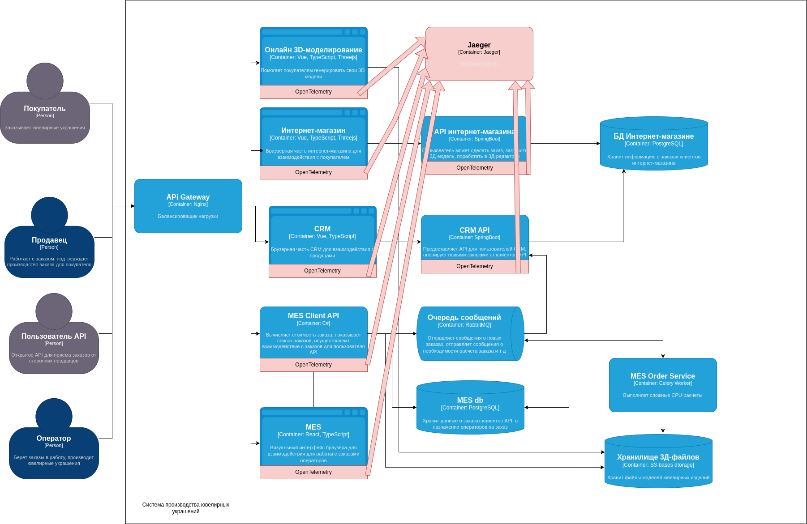

# Анализ системы

В текущей системе трейсингом следует покрыть все компоненты, связанные с передачей данных по API:

- Сервис 3D-моделирования (заказ может зависнуть при моделировании, при скачивании данных их БД с 3D-файлами)
- Сервис онлайн-магазина (заказ может зависнуть на любой итерации: при создании, сохранении, оплате и т д)
- Сервис бэкенда для обработка заказов покупателей (аналогично двум предыдущим пунктам)
- CRM (заказ может зависнуть при подтверждении продавца, при получении заказов)
- CRM API (аналогично CRM)
- API для клиентов MES (заказ может зависнуть на этапе создания, загрузки данных и т д)
- API для операторов MES (может зависнуть операции с заказом, вывод списка заказов)

### Данные для попадания в трейсинг:

- Идентификатор запроса
- Данные запроса (тело, query-параметры), чтобы можно было воспроизвести проблему в будущем при отладке

# Мотивация

Трейсинг будет очень полезен в случае возникновения бага или ошибки в системе - он поможет отследить путь запроса,
место, где произошла поломка и ключевые данные, при которых случилась ошибка. Это поможет оперативно воспроизвести
проблему, повторить ее, а также понять, в чем ее причина.

## Предлагаемое решение

Для всех сервисов, у которых есть API, необходимо подключить OpenTelemetry. Для этого необходимо ввести изменения в
исходный код и поставить необходимые зависимости. Для каждого сервиса необходимо создать свой спан-ярлык.
Также необходимо поднять Jaeger-контейнер, который будет собирать и отображать на своей стороне трейсинг запросов.

## Компромиссы

Всю систему невозможно обложить трейсингом, так как есть очереди задач и воркеры, выполняющие сложную логику CPU. Для
отслеживания таких типов задач и проблем лучше использовать метрики. Однако для всех сервисов с API составляющей
трейсинг отлично подойдет.

## Аспекты безопасности

Вход в Jaeger будет доступен только залогиненным пользователям - операторам трейсинга и девопсам с ролью “Поддержка”.
Кроме того, API Gateway должна закрыть доступ пользователям извне на порт, на котором открыт Jaeger. По нему могут
постучаться только пользователи общей сети VPN-компании.

