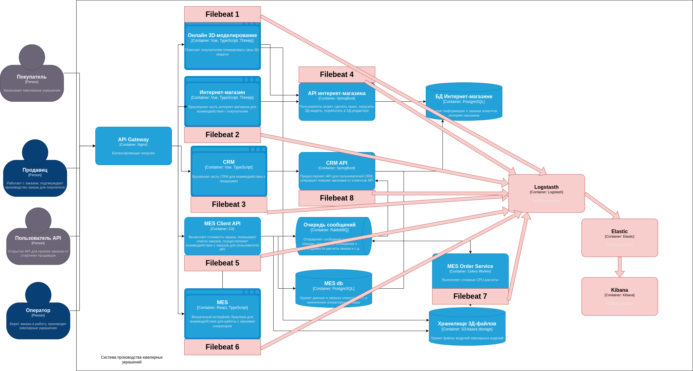

# Анализ системы компании и С4-диаграммы в контексте планирования логирования

## Логи, которые необходимо собирать:

### Список необходимых логов с уровнем INFO:

#### Сервис онлайн 3D-моделирования

1) Изменение статуса 3D модели. Логируем время, идентификатор модели, идентификатор пользователя, статус заказа.
2) Загрузка новой модели. Логируем время, идентификатор модели, идентификатор пользователя.
3) Авторизация пользователя. Логируем время, идентификатор пользователя

#### Сервис интернет-магазина

1) Создание заказа. Логируем время, идентификатор заказа, идентификатор пользователя.
2) Изменение статуса заказа. Логируем время, идентификатор заказа, идентификатор пользователя, статус заказа.
3) Авторизация пользователя. Логируем время, идентификатор пользователя

#### Сервис API интернет-магазина

1) Изменение статуса заказа. Логируем время, идентификатор заказа, идентификатор пользователя, статус заказа.
2) Генерация подписаннной ссылки. Логируем время, идентификатор пользователя, идентификатор модели.

#### CRM

1) Изменение статуса заказа. Логируем время, идентификатор заказа, идентификатор пользователя, статус заказа.
2) Авторизация пользователя. Логируем время, идентификатор пользователя

#### CRM API

1) Изменение статуса заказа. Логируем время, идентификатор заказа, идентификатор пользователя, статус заказа.
2) Получение события о новом заказе по MES API. Логируем время, идентификатор заказа

#### MES Client API

1) Создание заказа. Логируем время, идентификатор заказа, идентификатор пользователя.
2) Изменение статуса заказа. Логируем время, идентификатор заказа, идентификатор пользователя, статус заказа.
3) Авторизация пользователя. Логируем время, идентификатор пользователя
4) Загрузка новой модели. Логируем время, идентификатор модели, идентификатор пользователя.

#### MES

1) Авторизация пользователя. Логируем время, идентификатор пользователя.
2) Взятие заказа в работу. Логируем время, идентификатор пользователя, идентификатор заказа.

#### MES Order Service

1) Изменение статуса расчета модели. Логируем время, идентификатор модели, статус модели

### Использование других уровней логирования:

1) DEBUG будем логировать все сложные с точки зрения логики части системы, чтобы быстрее понимать, где что-то пошло не
   так, если возникла ошибка. Также предполагается логировать уровнем DEBGUG слои репозиторием (входные и выходные
   данные). Также логировать вход и выход методов API (начало обработки бизнес-логики и входные модели, окончание
   обработки бизнес-логики и выходные модели)
2) ERROR для всех возникающих ошибок в разных частях системы (проблема при загрузке модели, проблемы расчета модели,
   проблемы с авторизацией пользователя)

# Мотивация

### Причины, по которым необходимо внедрение логирования

1) Логирование очень полезно в ситуациях, когда случается баг. Так, корректно настроенная система логирования позволит
   разработчикам просмотреть логи, проанализировать ситуацию, быстрее найти причину проблему и устранить ее. Для
   бизнеса - это сэкономленные деньги на отладку приложения, а также незначительные потери доверия пользователя, так как
   проблема сможет исправиться быстрее.
2) Логирование сможет наглядно показать, как система ведет себя в тех или иных ситуациях, при тех или иных входных
   параметрах. Что может быть полезно при тестировании системы и для устранения неполадок
2) Логирование позволит мониторить узкие места системы, анализировать логи и находить потенциальные уязвимости,
   устранять их до того, как это превратилось в проблему. Это позволит бизнесу оставаться в глазах пользователей
   надежной системой, в которой минимальны риски сбоев.
3) При использовании ELK-стека возможно построение графиков и отчетов, анализ производительности сервисов, анализ
   количества ошибок. Это также полезно бизнесу, так как помогает предотвратить проблемы до их непосредственного
   негативного влияния на пользователей

### Приоритетные системы для внедрения трейсинга и логирования

Важно поставить системы логирования и монитория в самые уязвимые и узкие места системы. Пункты в списке ниже выставлены
в порядке приоритетности поставки.

1) Система расчета 3D-моделей. Так как основные простои связаны с длительными расчетами, важно ответственно следить за
   тем, как долго происходят расчеты и хватает ли мощностей
2) Система 3D-моделирования онлайн-магазина. Аналогично п.1, 3D-редактор - "тяжелая" операция, которая значительно
   ухудшает опыт пользователей, важно, чтобы она работала штатно, чтобы хватало "железа". Важно отслеживать
   работоспособность и устойчивость к загрузке данной системы
3) CRM - входная точка для продавца. Продавец обязан четко и быстро обрабатывать заказы, поэтому система CRM должна
   работать без сбоев
4) MES API - входная точка для операторов и клиентов. Должна работать без сбоев, так как покрывает собой большие группы
   пользователей
5) СRM API, MES - должны работать штатно, чтобы обеспечивать бесперебойную работу системы. Задержки негативно скажутся
   на пользовательский опыт.

# Предлагаемое решение

1) В каждый сервис, где предполагаются логи, необходимо добавить логи в едином формате средствами языка разработки и
   поддерживаемых библиотек для обеспечения логирования
2) Необходимо дополнительно поднять ELK стек, который будет считывать логи сервисов и отправлять их в Kibana. Это
   необходимо для удобства просмотра, анализа логов разработчиками

### Политика безопасности

В логах не должно находиться чувствительной информации:

- паролей, имен пользователя
- переменных среды
- токенов
- и т п информации

Такие данные не должны попадать в логи. За реализацию этого процесса отвечает сервис, в котором формируются логи.

К логам (в Kibana) доступ будет произвотися через корпоративную сеть VPN, доступ по логину и паролю для сотрудников
компании, которым разрешен доступ к логам

### Политика хранения логов

1) Все логи будут храниться в общем индексе jewerly-{yyyy-MM-dd}
2) В каждом лог-сообщении обязательно должна присутствовать метка, показывающая принадлежность конкретному сервису
3) Храниться логи могут в течении года (или меньше - по потребности бизнеса). Предполагается, что время хранения логов -
   время, когда разработчики смогут помочь при проблемах с заказом.
4) Размер индекса - динамическое понятие, но в идеале, чтобы за год размер индексов в шарде Elasticsearch не
   растягивался крупнее, чем
   50 Гигабайт, чтобы не нагружать систему, где расположен Elasticsearch значительно, и чтобы поиск по логам работал
   корректно и быстро

# Превращение системы сбора логов в систему анализа логов

1) Необходимо корректно настроить logstash, чтобы логи доставлялись в едином формате. В идеале в виде json с
   максимальным количеством бизнес-ключей, по которым в будущем можно построить дашборды
2) Необходимо построить дашборды Kibana на основании данных индексов Elasticsearch с визуальным отображением
   бизнес-метрик
3) Настройка алертинга на основании дашбордов Kibana:
    1) Пороговые значения
    2) Изменения тренда
    3) Отсутствие данных
    4) Комбинированные алерты
4) Настройка каналов отправки данных алертов - в телеграм, на почту, по другим каналам связи
5) Настройка поиска аномалий в логах на основании встроенных средств Anomaly Detection Jobs или базовых статистических
   методов в дашбордах Kibana (Среднее значение, стандартное отклонение, скользящее среднее)
    1) Аномалии объема логов
    2) Аномалии в метриках (отклонения в нормальных значениях)
6) Анализ первопричин (разработчиком/аналитиком)

### Примеры аномалий:
 * Резкий рост определенных типов логов (как в вашем примере с заказами).
 * Неожиданное падение трафика (может указывать на проблемы с доступностью сервиса).
 * Изменение паттернов ошибок (появление новых типов ошибок или резкое увеличение частоты существующих ошибок).
 * Аномальное поведение пользователей (например, большое количество неудачных попыток входа с одного IP-адреса).
 * Аномалии в использовании ресурсов (резкий рост потребления CPU, памяти, дискового пространства).