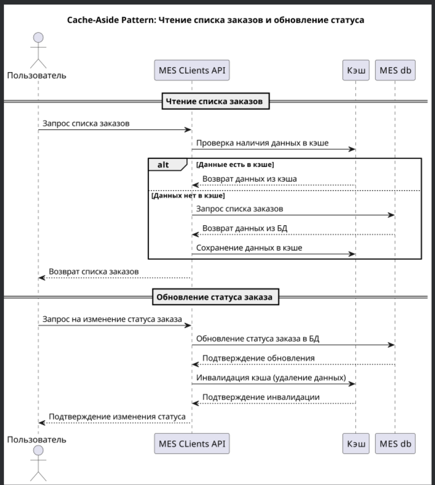

# Анализ необходимости кэширования в текущей диаграмме

Обозначено 2 проблемы в MES:

1) Низкая скорость работы со страницей
2) Низкая скорость выполнения заказа

Так как было решено вынести логику по сложным CPU задачам из MES API в Order Service API, то загруженность MES API по
оценке стоимости и анализу заказа значительно снизятся, а так как MES ходит к MES API client, то данный вопрос (второй)
по сути был решен ранее без применения кэширования.

Остается первый вопрос - низкая скорость работы со страницей. Часть его тоже решится после вынесение логики по сложным
CPU задачам из MES API в Order Service API. Однако сервис все еще будет нагружен запросами по поводу заказов как от
клиентов, так и от операторов. Часть из них можно кэшировать, так как в них превалирует чтение.

# Мотивация

Внедрение кэширование позволит снизить нагрузку с баз данных, а также ускорит получение важной информации, что
положительно скажется на пользовательском опыте, так как скорость работы со страницей увеличится.

# Предлагаемое решение

Для решения задачи лучше всего себя покажет серверное кэширование. Оно подходит больше, так как предполагается высокая
нагрузка на чтение и более редкая нагрузка на запись одних и тех же данных о заказах конкретных пользователей как со
стороны клиентов, так и со стороны операторов.

- Паттерн кэширования: ***Cache-Aside***. Данная стратегия подойдет больше, так как предполагается большее количество
  запросов
  на чтение + хотелось бы обрабатывать на сервисе бэкенда доступ к данным БД и к данным кэша, чтобы иметь больше
  гибкости и отслеживать ошибки, иметь возможность хранения разных моделей данных в кэше и в базе данных
- Стратегия инвалидации кэша: ***Инвалидация, основанная на запросах***. Данная стратегия подойдет больше, так как
  данный
  способ обеспечивает надёжность и актуальность данных, основываясь на активности и запросах пользователей, что крайне
  важно в разрабатываемом сервисе.

